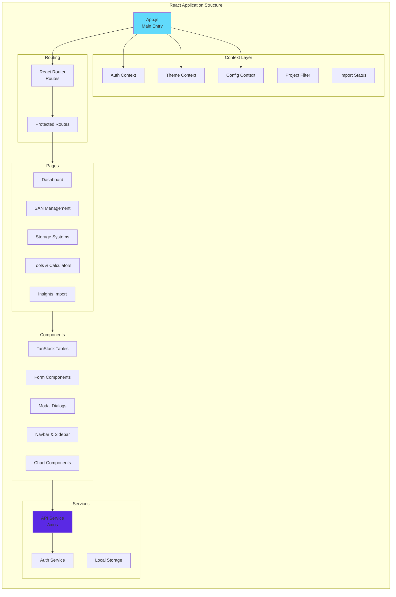
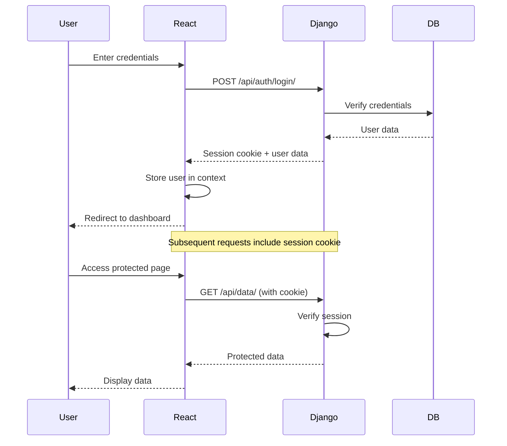
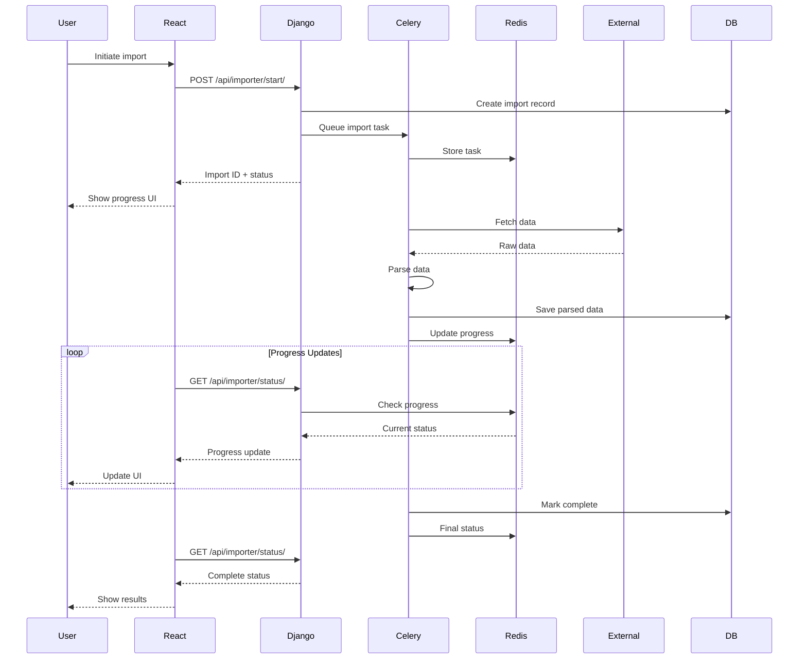
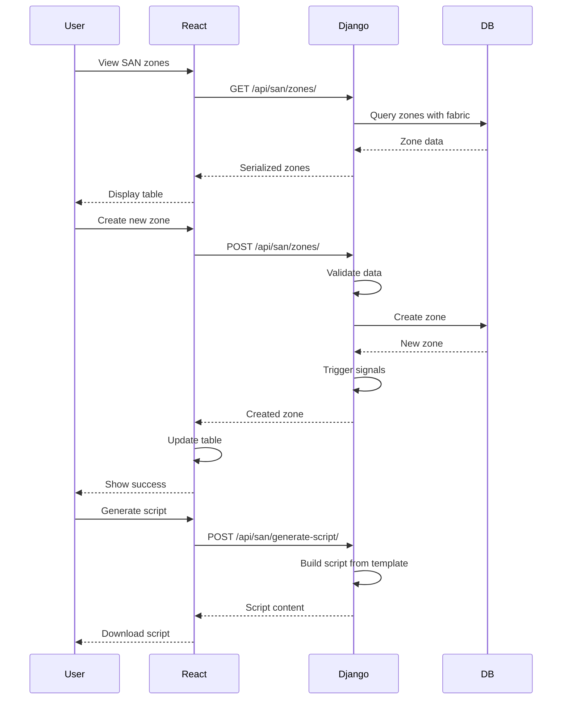
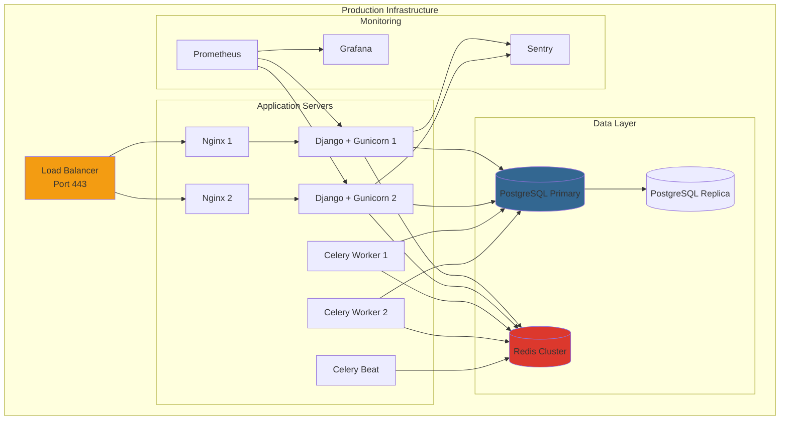
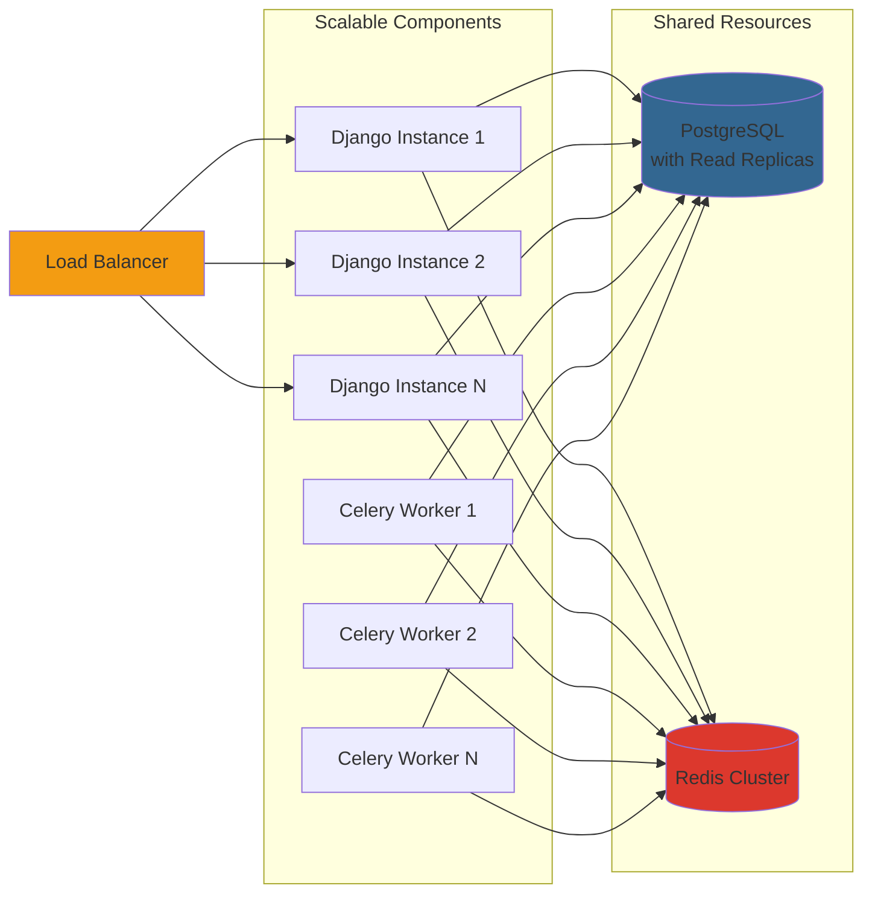

# Sanbox - System Architecture

## Current Architecture Overview

```mermaid
graph TB
    subgraph "Client Layer"
        Browser[Web Browser]
    end

    subgraph "Frontend - React Application"
        ReactApp[React App<br/>Port 3000/8080]
        Router[React Router]
        Context[Context Providers<br/>Auth, Theme, Config]
        Components[Components<br/>Tables, Forms, Dashboards]
    end

    subgraph "Reverse Proxy"
        Nginx[Nginx<br/>Port 80/443]
    end

    subgraph "Backend - Django Application"
        Django[Django API<br/>Port 8000]
        DRF[Django REST Framework]
        Auth[Authentication]
        
        subgraph "Django Apps"
            Core[Core<br/>Config, Settings]
            Customers[Customers<br/>Customer Management]
            SAN[SAN<br/>Fabric, Zones, Aliases]
            Storage[Storage<br/>Storage Systems]
            Importer[Importer<br/>Data Import]
            Backup[Backup<br/>Backup Management]
        end
    end

    subgraph "Task Queue"
        Celery[Celery Workers]
        CeleryBeat[Celery Beat<br/>Scheduler]
    end

    subgraph "Data Layer"
        PostgreSQL[(PostgreSQL<br/>Database)]
        Redis[(Redis<br/>Cache & Queue)]
    end

    subgraph "External Systems"
        IBMInsights[IBM Storage Insights API]
        SwitchConfigs[Switch Configurations<br/>Brocade, Cisco]
    end

    Browser --> Nginx
    Nginx --> ReactApp
    Nginx --> Django
    
    ReactApp --> Router
    Router --> Components
    Components --> Context
    
    ReactApp -->|API Calls| Django
    Django --> DRF
    DRF --> Auth
    DRF --> Core
    DRF --> Customers
    DRF --> SAN
    DRF --> Storage
    DRF --> Importer
    DRF --> Backup
    
    Django --> PostgreSQL
    Django --> Redis
    
    Celery --> Redis
    CeleryBeat --> Redis
    Celery --> PostgreSQL
    
    Importer -->|Fetch Data| IBMInsights
    Importer -->|Parse Configs| SwitchConfigs
    
    style Browser fill:#e1f5ff
    style ReactApp fill:#61dafb
    style Django fill:#092e20
    style PostgreSQL fill:#336791
    style Redis fill:#dc382d
    style Celery fill:#37814a
```

## Detailed Component Architecture

### Frontend Architecture

### Backend Architecture

```mermaid
graph TB
    subgraph "Django Backend Structure"
        URLs[URL Router<br/>sanbox/urls.py]
        
        subgraph "API Layer"
            Views[API Views<br/>ViewSets]
            Serializers[Serializers<br/>Data Validation]
            Permissions[Permissions<br/>Access Control]
        end
        
        subgraph "Business Logic"
            Models[Django Models]
            Signals[Django Signals]
            Utils[Utility Functions]
            Parsers[Data Parsers<br/>Brocade, Cisco]
        end
        
        subgraph "Background Tasks"
            Tasks[Celery Tasks]
            Orchestrator[Import Orchestrator]
        end
        
        subgraph "Data Access"
            ORM[Django ORM]
            Cache[Cache Layer]
            QueryOpt[Query Optimization]
        end
    end
    
    URLs --> Views
    Views --> Serializers
    Views --> Permissions
    Serializers --> Models
    
    Models --> Signals
    Models --> ORM
    
    Views --> Utils
    Utils --> Parsers
    
    Tasks --> Orchestrator
    Orchestrator --> Parsers
    Tasks --> Models
    
    ORM --> Cache
    ORM --> QueryOpt
    
    style URLs fill:#092e20
    style Models fill:#44b78b
    style Tasks fill:#37814a
```

## Data Flow Diagrams

### User Authentication Flow

### Data Import Flow

### SAN Zone Management Flow

## Deployment Architecture

### Development Environment

```mermaid
graph TB
    subgraph "Developer Machine"
        Code[Source Code]
        Git[Git Repository]
        
        subgraph "Docker Compose Dev"
            FrontendDev[React Dev Server<br/>Port 3000]
            BackendDev[Django Dev Server<br/>Port 8000]
            PostgresDev[(PostgreSQL)]
            RedisDev[(Redis)]
            CeleryDev[Celery Worker]
        end
    end
    
    Code --> Git
    Code --> FrontendDev
    Code --> BackendDev
    
    BackendDev --> PostgresDev
    BackendDev --> RedisDev
    CeleryDev --> RedisDev
    CeleryDev --> PostgresDev
    
    FrontendDev -->|Proxy| BackendDev
    
    style FrontendDev fill:#61dafb
    style BackendDev fill:#092e20
```

### Production Environment

## Technology Stack Details

### Backend Stack

| Component | Technology | Version | Purpose |
|-----------|-----------|---------|---------|
| Framework | Django | 5.1.6 | Web framework |
| API | Django REST Framework | 3.15.2 | REST API |
| Database | PostgreSQL | 16 | Primary database |
| Cache | Redis | 7 | Caching & message broker |
| Task Queue | Celery | 5.5.3 | Background tasks |
| WSGI Server | Gunicorn | 23.0.0 | Production server |
| Language | Python | 3.12 | Programming language |

### Frontend Stack

| Component | Technology | Version | Purpose |
|-----------|-----------|---------|---------|
| Framework | React | 18.2.0 | UI framework |
| Routing | React Router | 7.2.0 | Client-side routing |
| UI Library | Bootstrap | 5.3.3 | UI components |
| Tables | TanStack Table | 8.21.3 | Data tables |
| Spreadsheet | Handsontable | 12.4.0 | Excel-like editing |
| HTTP Client | Axios | 1.6.0 | API communication |
| Charts | Chart.js, Recharts | Latest | Data visualization |
| Animation | Framer Motion | 12.5.0 | Animations |

### Infrastructure Stack

| Component | Technology | Version | Purpose |
|-----------|-----------|---------|---------|
| Container | Docker | Latest | Containerization |
| Orchestration | Docker Compose | Latest | Multi-container apps |
| Reverse Proxy | Nginx | Alpine | Load balancing |
| OS | Alpine Linux | Latest | Container base |

## Security Architecture

```mermaid
graph TB
    subgraph "Security Layers"
        subgraph "Network Security"
            Firewall[Firewall Rules]
            SSL[SSL/TLS Certificates]
            CORS[CORS Configuration]
        end
        
        subgraph "Application Security"
            Auth[Session Authentication]
            CSRF[CSRF Protection]
            XSS[XSS Prevention]
            Headers[Security Headers]
        end
        
        subgraph "Data Security"
            Encryption[Data Encryption]
            Validation[Input Validation]
            Sanitization[Output Sanitization]
            Permissions[Role-based Access]
        end
        
        subgraph "Infrastructure Security"
            Secrets[Secrets Management]
            Updates[Security Updates]
            Monitoring[Security Monitoring]
            Backups[Encrypted Backups]
        end
    end
    
    Firewall --> SSL
    SSL --> CORS
    CORS --> Auth
    
    Auth --> CSRF
    CSRF --> XSS
    XSS --> Headers
    
    Headers --> Encryption
    Encryption --> Validation
    Validation --> Sanitization
    Sanitization --> Permissions
    
    Permissions --> Secrets
    Secrets --> Updates
    Updates --> Monitoring
    Monitoring --> Backups
    
    style Auth fill:#e74c3c
    style Encryption fill:#e74c3c
    style Secrets fill:#e74c3c
```

## Scalability Considerations

### Horizontal Scaling

## Performance Optimization Points

1. **Database Layer**
   - Connection pooling (pgBouncer)
   - Query optimization with indexes
   - Read replicas for reporting
   - Materialized views for complex queries

2. **Caching Layer**
   - Redis for session storage
   - API response caching
   - Database query result caching
   - Static file caching

3. **Application Layer**
   - Async task processing with Celery
   - Lazy loading of components
   - Code splitting for frontend
   - API pagination

4. **Infrastructure Layer**
   - CDN for static assets
   - Load balancing
   - Container resource limits
   - Nginx caching

## Future Architecture Enhancements

1. **Microservices Migration** (Optional)
   - Split monolith into services
   - API Gateway pattern
   - Service mesh (Istio)

2. **Event-Driven Architecture**
   - Message queue (RabbitMQ/Kafka)
   - Event sourcing
   - CQRS pattern

3. **Advanced Monitoring**
   - Distributed tracing (Jaeger)
   - APM (Application Performance Monitoring)
   - Log aggregation (ELK Stack)

4. **High Availability**
   - Multi-region deployment
   - Database replication
   - Disaster recovery
   - Automated failover

---

This architecture provides a solid foundation for a production-ready SAN management platform with room for growth and optimization.